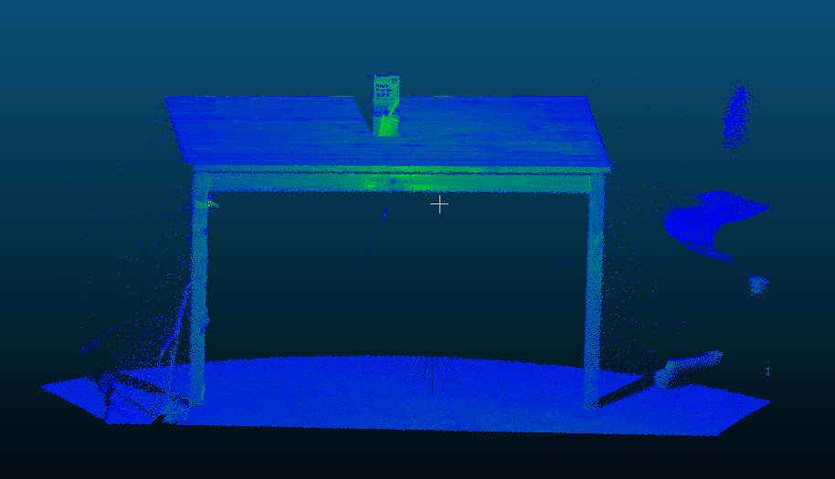
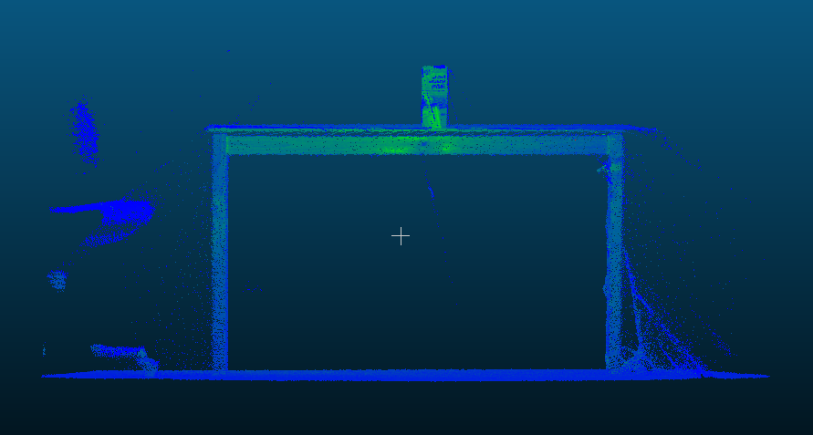
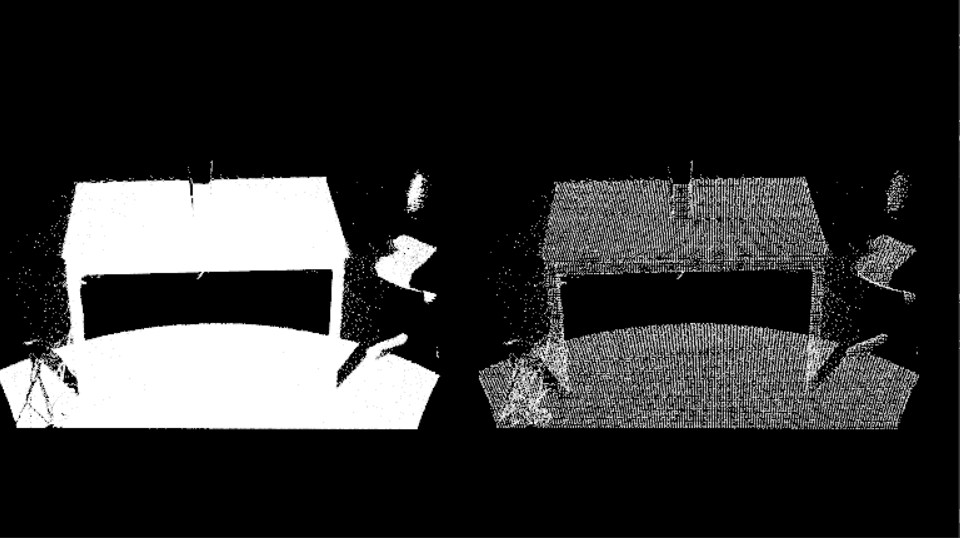
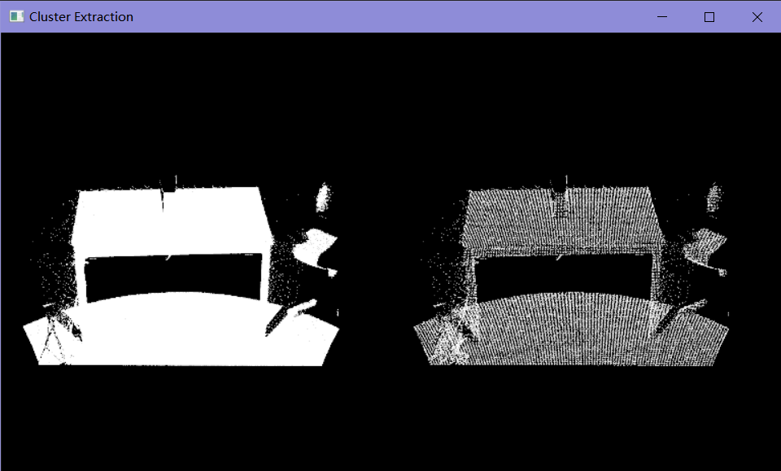
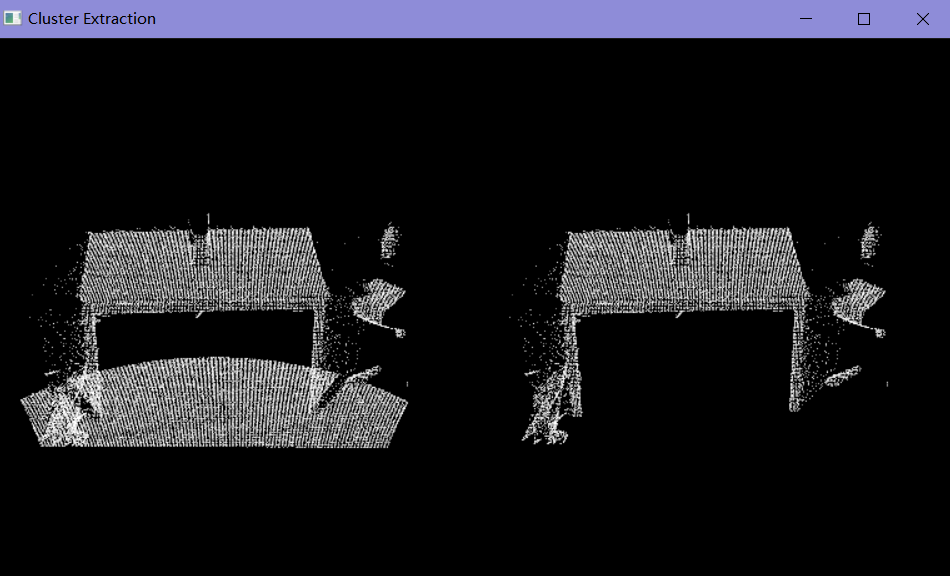
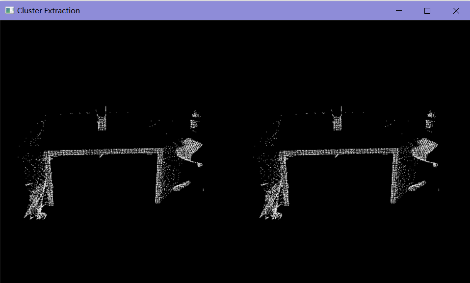
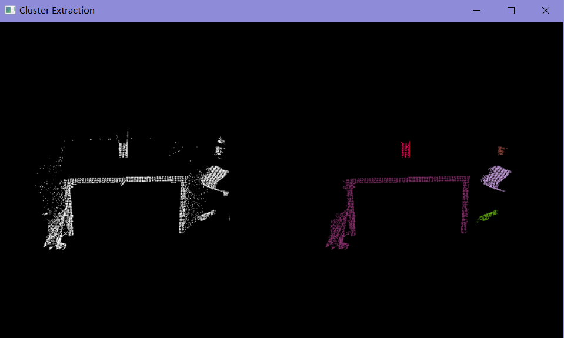

>  原文链接：[Euclidean Cluster Extraction](https://pcl.readthedocs.io/projects/tutorials/en/latest/cluster_extraction.html#cluster-extraction)

**目录**

[ 理论基础](# 理论基础)

[ 程序代码](# 程序代码)

[代码解析](#代码解析)

[ 使用Kd-tree作为抽取算法的搜索方法](# 使用Kd-tree作为抽取算法的搜索方法)

[ 创建EuclideanClusterExtraction对象，并设置参数](# 创建EuclideanClusterExtraction对象，并设置参数)

[实验结果](#实验结果)

[点云处理全过程](#点云处理全过程)

[ 滤波](# 滤波)

[ 平面分割并去除](# 平面分割并去除)

[ 聚类抽取](# 聚类抽取)

[ 打印结果](# 打印结果)

[ CMakeLists.txt](# CMakeLists.txt)

------

在本篇教程中，我们将学习使用**pcl::EuclideanClusterExtraction类**提取欧几里德聚类。为了使本篇教程更加精简，之前教程中提到的知识点将不再重复说明，比如平面模型分割，可参考之前的博文：PCL教程-[点云分割之平面模型分割](https://blog.csdn.net/luolaihua2018/article/details/120136665)

> 数据集下载链接： [table_scene_lms400.pcd](https://raw.github.com/PointCloudLibrary/data/master/tutorials/table_scene_lms400.pcd)

#  理论基础

聚类方法，通过特征空间确定点与点之间的亲疏程度。

一个聚类方法需要将一个无序的点云模型P分割成更小的部分，使得处理P的整体时间显著减少。一种简单的欧氏聚类方法可以通过使用固定宽度的框对空间进行三维网格细分来实现，或者更普遍地说，使用八叉树数据结构。

这种特殊的表示非常快速，对于需要占用空间的体积表示，或者对每个结果3D盒子(或八叉树叶子)中的数据可以近似为不同的结构的情况非常有用。

然而，在更一般的意义上，我们可以利用最近邻并实现一种本质上类似于漫水填充算法的聚类技术。

假设我们使用的点云数据的场景为：一张桌子，以及桌子上放置的一些东西。我们要找出并分割平面上的单个目标点云族:





 假设我们使用Kd-tree结构去查找最近邻，算法步骤如下：

1. 为输入的点云数据集P创建Kd-tree的表示
2. 设置一个空的聚类列表C，以及一个需要被检查的点云队列Q
3. 然后对P中的每一个点p_i进行如下步骤： 
   1. 将p_i添加到当前队列Q
   2. 对每个Q中的 p_i 进行如下步骤： 	
      1. 设置半径 r<d_th，在此范围内搜索 p_i 的 最近邻 点云集 P_i_k.
      2. 对于每个最近邻点云集 P_i_k ,检查其中的点是否被处理过，如果没有被处理过，就添加到Q中。
4. 当Q中列表中的所有点都被处理完成了，把Q添加到聚类列表C中，并将Q清空。
5. 当数据集P中的所有点都被处理过了，并且成了聚类列表中的一部分，算法完成。

#  程序代码

```cpp
#include <pcl/ModelCoefficients.h>
#include <pcl/point_types.h>
#include <pcl/io/pcd_io.h>
#include <pcl/filters/extract_indices.h>
#include <pcl/filters/voxel_grid.h>
#include <pcl/features/normal_3d.h>
#include <pcl/kdtree/kdtree.h>
#include <pcl/sample_consensus/method_types.h>
#include <pcl/sample_consensus/model_types.h>
#include <pcl/segmentation/sac_segmentation.h>
#include <pcl/segmentation/extract_clusters.h>
#include<pcl/visualization/pcl_visualizer.h>
bool isPushSpace = false;
//键盘事件
void keyboard_event_occurred(const pcl::visualization::KeyboardEvent& event, void * nothing)
{
	if (event.getKeySym() == "space" && event.keyDown())
	{
		isPushSpace = true;
	}
}
int
main(int argc, char** argv)
{
	// 从PCD文件中读取点云数据
	pcl::PCDReader reader;
	pcl::PointCloud<pcl::PointXYZ>::Ptr cloud(new pcl::PointCloud<pcl::PointXYZ>), cloud_f(new pcl::PointCloud<pcl::PointXYZ>);
	reader.read("table_scene_lms400.pcd", *cloud);
	std::cout << "PointCloud before filtering has: " << cloud->points.size() << " data points." << std::endl; //*

	pcl::visualization::PCLVisualizer viewer("Cluster Extraction");
	// 注册键盘事件
	viewer.registerKeyboardCallback(&keyboard_event_occurred, (void*)NULL);
	int v1(1);
	int v2(2);
	viewer.createViewPort(0, 0, 0.5, 1, v1);
	viewer.createViewPort(0.5, 0, 1, 1, v2);

	//创建滤波对象: 使用下采样，叶子的大小为 1cm
	pcl::VoxelGrid<pcl::PointXYZ> vg;
	pcl::PointCloud<pcl::PointXYZ>::Ptr cloud_filtered(new pcl::PointCloud<pcl::PointXYZ>);
	vg.setInputCloud(cloud);
	vg.setLeafSize(0.01f, 0.01f, 0.01f);
	vg.filter(*cloud_filtered);
	std::cout << "PointCloud after filtering has: " << cloud_filtered->points.size() << " data points." << std::endl; //*

	viewer.addPointCloud(cloud, "cloud1", v1);
	viewer.addPointCloud(cloud_filtered, "cloud2", v2);
	//渲染10秒再继续
	viewer.spinOnce(10000);

	// 创建平面分割对象
	pcl::SACSegmentation<pcl::PointXYZ> seg;
	pcl::PointIndices::Ptr inliers(new pcl::PointIndices);
	pcl::ModelCoefficients::Ptr coefficients(new pcl::ModelCoefficients);
	pcl::PointCloud<pcl::PointXYZ>::Ptr cloud_plane(new pcl::PointCloud<pcl::PointXYZ>());
	pcl::PCDWriter writer;
	seg.setOptimizeCoefficients(true);
	seg.setModelType(pcl::SACMODEL_PLANE);
	seg.setMethodType(pcl::SAC_RANSAC);
	seg.setMaxIterations(100);
	seg.setDistanceThreshold(0.02);

	// 把点云中所有的平面全部过滤掉，重复过滤，直到点云数量小于原来的0.3倍
	int i = 0, nr_points = (int)cloud_filtered->points.size();
	while (cloud_filtered->points.size() > 0.3 * nr_points)
	{	
		// Segment the largest planar component from the remaining cloud
		seg.setInputCloud(cloud_filtered);
		seg.segment(*inliers, *coefficients);
		if (inliers->indices.size() == 0)
		{
			std::cout << "Could not estimate a planar model for the given dataset." << std::endl;
			break;
		}

		// Extract the planar inliers from the input cloud
		pcl::ExtractIndices<pcl::PointXYZ> extract;
		extract.setInputCloud(cloud_filtered);
		extract.setIndices(inliers);
		extract.setNegative(false);

		// Write the planar inliers to disk
		extract.filter(*cloud_plane);
		std::cout << "PointCloud representing the planar component: " << cloud_plane->points.size() << " data points." << std::endl;

		// Remove the planar inliers, extract the rest
		extract.setNegative(true);
		extract.filter(*cloud_f);

		//更新显示点云
		viewer.updatePointCloud(cloud_filtered, "cloud1");
		viewer.updatePointCloud(cloud_f, "cloud2");
		//渲染3秒再继续
		viewer.spinOnce(3000);

		cloud_filtered = cloud_f;

	}

	viewer.removePointCloud("cloud2", v2);

	// 创建KdTreee对象作为搜索方法
	pcl::search::KdTree<pcl::PointXYZ>::Ptr tree(new pcl::search::KdTree<pcl::PointXYZ>);
	tree->setInputCloud(cloud_filtered);

	std::vector<pcl::PointIndices> cluster_indices;
	pcl::EuclideanClusterExtraction<pcl::PointXYZ> ec;
	ec.setClusterTolerance(0.02); // 2cm
	ec.setMinClusterSize(100);
	ec.setMaxClusterSize(25000);
	ec.setSearchMethod(tree);
	ec.setInputCloud(cloud_filtered);
	//聚类抽取结果保存在一个数组中，数组中每个元素代表抽取的一个组件点云的下标
	ec.extract(cluster_indices);

	//遍历抽取结果，将其显示并保存
	int j = 0;
	for (std::vector<pcl::PointIndices>::const_iterator it = cluster_indices.begin(); it != cluster_indices.end(); ++it)
	{
		//创建临时保存点云族的点云
		pcl::PointCloud<pcl::PointXYZ>::Ptr cloud_cluster(new pcl::PointCloud<pcl::PointXYZ>);
		//通过下标，逐个填充
		for (std::vector<int>::const_iterator pit = it->indices.begin(); pit != it->indices.end(); pit++)
			cloud_cluster->points.push_back(cloud_filtered->points[*pit]); //*

		//设置点云属性
		cloud_cluster->width = cloud_cluster->points.size();
		cloud_cluster->height = 1;
		cloud_cluster->is_dense = true;

		std::cout << "当前聚类 "<<j<<" 包含的点云数量: " << cloud_cluster->points.size() << " data points." << std::endl;
		std::stringstream ss;
		ss << "cloud_cluster_" << j << ".pcd";
		writer.write<pcl::PointXYZ>(ss.str(), *cloud_cluster, false); //*
		j++;

		//显示,随机设置不同颜色，以区分不同的聚类
		pcl::visualization::PointCloudColorHandlerCustom<pcl::PointXYZ> cluster_color(cloud_cluster, rand()*100 + j * 80, rand() * 50 + j * 90, rand() * 200 + j * 100);
		viewer.addPointCloud(cloud_cluster,cluster_color, ss.str(), v2);
		viewer.spinOnce(5000);
	}
	while (!viewer.wasStopped())
	{
		viewer.spinOnce();
	}
	return (0);
}
```


# 代码解析

##  使用Kd-tree作为抽取算法的搜索方法

```cpp
// Creating the KdTree object for the search method of the extraction
  pcl::search::KdTree<pcl::PointXYZ>::Ptr tree (new pcl::search::KdTree<pcl::PointXYZ>);
  tree->setInputCloud (cloud_filtered);
```


##  创建EuclideanClusterExtraction对象，并设置参数

-  点云类型为：PointXYZ
- **setClusterTolerance(0.02)：设置聚类容忍度为2cm，如果设置的值过小，可能会将一个对象误判为多个聚类，反之，如果过大，则可能会将多个多个对象误判为一个聚类。所以需根据实际情况进行设置。**
- **setMinClusterSize()、setMaxClusterSize()** ：设置最大聚类和最小聚类的点云数量大小
- 结果保存在**cluster_indices，一个vector类型的数组，每个元素代表一个聚类的所有点云下标。**

```cpp
pcl::EuclideanClusterExtraction<pcl::PointXYZ> ec;
  ec.setClusterTolerance (0.02); // 2cm
  ec.setMinClusterSize (100);
  ec.setMaxClusterSize (25000);
  ec.setSearchMethod (tree);
  ec.setInputCloud (cloud_filtered);
  ec.extract (cluster_indices);
```


# 实验结果

## 点云处理全过程




##  滤波

左图为原始点云数据，右图为滤波后的点云：



##  平面分割并去除

将点云中所有平面都分割出来，并剔除：

## 

 

##  聚类抽取

使用Kd-tree的结构，对处理后的点云进行聚类抽取，右图为抽取之后的结果，不同颜色代表不同聚类点云：

 

##  打印结果

> PointCloud before filtering has: 460400 data points.
>  PointCloud after filtering has: 41049 data points.
>  PointCloud representing the planar component: 20536 data points.
>  PointCloud representing the planar component: 12442 data points.
>  当前聚类 0 包含的点云数量: 4857 data points.
>  当前聚类 1 包含的点云数量: 1386 data points.
>  当前聚类 2 包含的点云数量: 321 data points.
>  当前聚类 3 包含的点云数量: 291 data points.
>  当前聚类 4 包含的点云数量: 123 data points.

#  CMakeLists.txt

```cpp
cmake_minimum_required(VERSION 2.8 FATAL_ERROR)

project(cluster_extraction)

find_package(PCL 1.2 REQUIRED)

include_directories(${PCL_INCLUDE_DIRS})
link_directories(${PCL_LIBRARY_DIRS})
add_definitions(${PCL_DEFINITIONS})

add_executable (cluster_extraction cluster_extraction.cpp)
target_link_libraries (cluster_extraction ${PCL_LIBRARIES})
```


