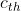
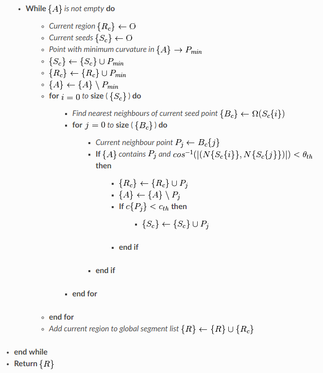
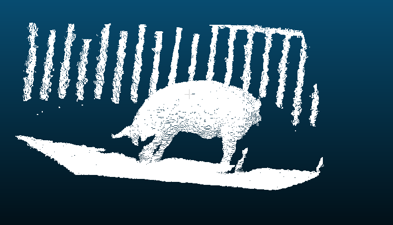
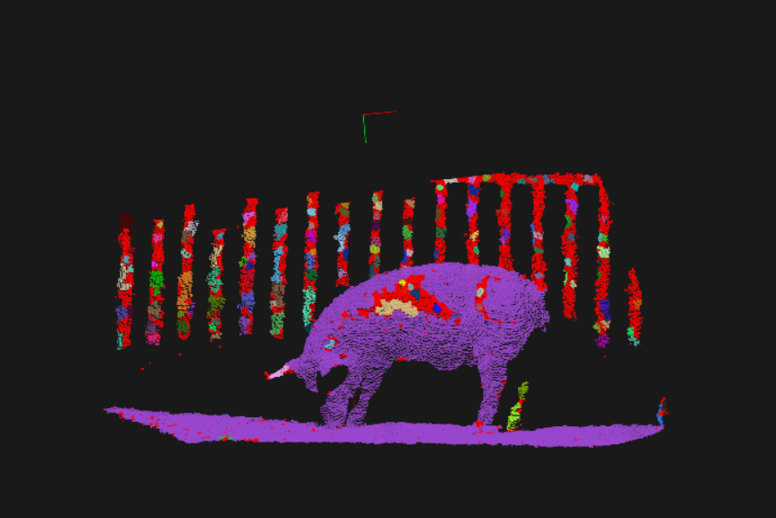
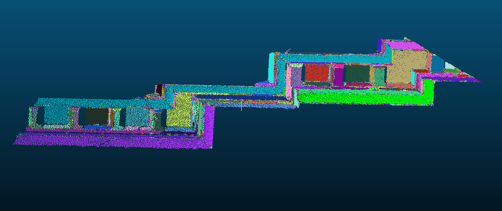
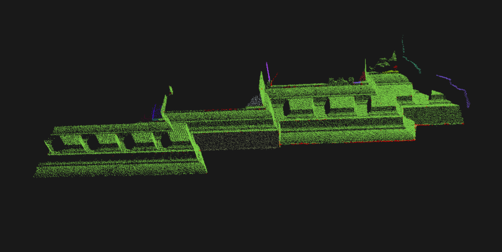

> 原文链接：[Region growing segmentation](https://pcl.readthedocs.io/projects/tutorials/en/latest/region_growing_segmentation.html#region-growing-segmentation)

在本篇教程中，我们将学习如何使用由**pcl::RegionGrowing类**实现的区域生长算法。该算法的目的是合并在平滑约束条件下足够接近的点。因此，该算法的输出数据结构是由聚类组成的数组，其中每个聚类都是被认为是同一光滑表面的一部分的点的集合。该算法的工作原理（光滑度的计算）是基于两点法线之间的角度比较。

# 基本原理

首先，它根据点的曲率值对点进行排序。需要这样做是因为区域从曲率最小的点开始增长。这样做的原因是曲率最小的点位于平坦区域(从最平坦区域生长可以减少段的总数)。

我们有了分类过的云。直到云中没有未标记点时，算法选取曲率值最小的点，开始区域的增长。这个过程如下所示：

- 选中的点被添加到名为种子的集合中。
- 对于每一个种子点，找到它的邻近点： 
  - 算出每个相邻点的法线和当前种子点的法线之间的角度，如果角度小于阈值，则将当前点添加到当前区域。
  - 然后计算每个邻居点的曲率值，如果曲率小于阈值，那么这个点被添加到种子中。
  - 将当前的种子从种子列表中移除。

如果种子列表变成空的，这意味着该区域生长已完成，继续重复上述过程。

# 算法伪代码

## 输入

- *Point cloud* = 
- *Point normals* = 
- *Points curvatures* = 
- *Neighbour finding function* )
- *Curvature threshold* 
- *Angle threshold* 

## 初始化

*区域列表置为空： Region list* 

可用的点云列表：*Available points list* 

## 算法实现




# 程序代码

```cpp
#include <pcl/ModelCoefficients.h>
#include <pcl/point_types.h>
#include <pcl/io/pcd_io.h>
#include <pcl/filters/extract_indices.h>
#include <pcl/filters/voxel_grid.h>
#include <pcl/features/normal_3d.h>
#include <pcl/kdtree/kdtree.h>
#include <pcl/sample_consensus/method_types.h>
#include <pcl/sample_consensus/model_types.h>
#include <pcl/segmentation/sac_segmentation.h>
#include <pcl/segmentation/extract_clusters.h>
#include<pcl/visualization/pcl_visualizer.h>
bool isPushSpace = false;
//键盘事件
void keyboard_event_occurred(const pcl::visualization::KeyboardEvent& event, void * nothing)
{
	if (event.getKeySym() == "space" && event.keyDown())
	{
		isPushSpace = true;
	}
}
int
main(int argc, char** argv)
{
	// 从PCD文件中读取点云数据
	pcl::PCDReader reader;
	pcl::PointCloud<pcl::PointXYZ>::Ptr cloud(new pcl::PointCloud<pcl::PointXYZ>), cloud_f(new pcl::PointCloud<pcl::PointXYZ>);
	reader.read("table_scene_lms400.pcd", *cloud);
	std::cout << "PointCloud before filtering has: " << cloud->points.size() << " data points." << std::endl; //*

	pcl::visualization::PCLVisualizer viewer("Cluster Extraction");
	// 注册键盘事件
	viewer.registerKeyboardCallback(&keyboard_event_occurred, (void*)NULL);
	int v1(1);
	int v2(2);
	viewer.createViewPort(0, 0, 0.5, 1, v1);
	viewer.createViewPort(0.5, 0, 1, 1, v2);

	//创建滤波对象: 使用下采样，叶子的大小为 1cm
	pcl::VoxelGrid<pcl::PointXYZ> vg;
	pcl::PointCloud<pcl::PointXYZ>::Ptr cloud_filtered(new pcl::PointCloud<pcl::PointXYZ>);
	vg.setInputCloud(cloud);
	vg.setLeafSize(0.01f, 0.01f, 0.01f);
	vg.filter(*cloud_filtered);
	std::cout << "PointCloud after filtering has: " << cloud_filtered->points.size() << " data points." << std::endl; //*

	viewer.addPointCloud(cloud, "cloud1", v1);
	viewer.addPointCloud(cloud_filtered, "cloud2", v2);
	//渲染10秒再继续
	viewer.spinOnce(10000);

	// 创建平面分割对象
	pcl::SACSegmentation<pcl::PointXYZ> seg;
	pcl::PointIndices::Ptr inliers(new pcl::PointIndices);
	pcl::ModelCoefficients::Ptr coefficients(new pcl::ModelCoefficients);
	pcl::PointCloud<pcl::PointXYZ>::Ptr cloud_plane(new pcl::PointCloud<pcl::PointXYZ>());
	pcl::PCDWriter writer;
	seg.setOptimizeCoefficients(true);
	seg.setModelType(pcl::SACMODEL_PLANE);
	seg.setMethodType(pcl::SAC_RANSAC);
	seg.setMaxIterations(100);
	seg.setDistanceThreshold(0.02);

	// 把点云中所有的平面全部过滤掉，重复过滤，直到点云数量小于原来的0.3倍
	int i = 0, nr_points = (int)cloud_filtered->points.size();
	while (cloud_filtered->points.size() > 0.3 * nr_points)
	{	
		// Segment the largest planar component from the remaining cloud
		seg.setInputCloud(cloud_filtered);
		seg.segment(*inliers, *coefficients);
		if (inliers->indices.size() == 0)
		{
			std::cout << "Could not estimate a planar model for the given dataset." << std::endl;
			break;
		}

		// Extract the planar inliers from the input cloud
		pcl::ExtractIndices<pcl::PointXYZ> extract;
		extract.setInputCloud(cloud_filtered);
		extract.setIndices(inliers);
		extract.setNegative(false);

		// Write the planar inliers to disk
		extract.filter(*cloud_plane);
		std::cout << "PointCloud representing the planar component: " << cloud_plane->points.size() << " data points." << std::endl;

		// Remove the planar inliers, extract the rest
		extract.setNegative(true);
		extract.filter(*cloud_f);

		//更新显示点云
		viewer.updatePointCloud(cloud_filtered, "cloud1");
		viewer.updatePointCloud(cloud_f, "cloud2");
		//渲染3秒再继续
		viewer.spinOnce(3000);

		cloud_filtered = cloud_f;

	}

	viewer.removePointCloud("cloud2", v2);

	// 创建KdTreee对象作为搜索方法
	pcl::search::KdTree<pcl::PointXYZ>::Ptr tree(new pcl::search::KdTree<pcl::PointXYZ>);
	tree->setInputCloud(cloud_filtered);

	std::vector<pcl::PointIndices> cluster_indices;
	pcl::EuclideanClusterExtraction<pcl::PointXYZ> ec;
	ec.setClusterTolerance(0.02); // 2cm
	ec.setMinClusterSize(100);
	ec.setMaxClusterSize(25000);
	ec.setSearchMethod(tree);
	ec.setInputCloud(cloud_filtered);
	//聚类抽取结果保存在一个数组中，数组中每个元素代表抽取的一个组件点云的下标
	ec.extract(cluster_indices);
	
	//遍历抽取结果，将其显示并保存
	int j = 0;
	for (std::vector<pcl::PointIndices>::const_iterator it = cluster_indices.begin(); it != cluster_indices.end(); ++it)
	{
		//创建临时保存点云族的点云
		pcl::PointCloud<pcl::PointXYZ>::Ptr cloud_cluster(new pcl::PointCloud<pcl::PointXYZ>);
		//通过下标，逐个填充
		for (std::vector<int>::const_iterator pit = it->indices.begin(); pit != it->indices.end(); pit++)
			cloud_cluster->points.push_back(cloud_filtered->points[*pit]); //*

		//设置点云属性
		cloud_cluster->width = cloud_cluster->points.size();
		cloud_cluster->height = 1;
		cloud_cluster->is_dense = true;

		std::cout << "当前聚类 "<<j<<" 包含的点云数量: " << cloud_cluster->points.size() << " data points." << std::endl;
		std::stringstream ss;
		ss << "cloud_cluster_" << j << ".pcd";
		writer.write<pcl::PointXYZ>(ss.str(), *cloud_cluster, false); //*
		j++;

		//显示,随机设置不同颜色，以区分不同的聚类
		pcl::visualization::PointCloudColorHandlerCustom<pcl::PointXYZ> cluster_color(cloud_cluster, rand()*100 + j * 80, rand() * 50 + j * 90, rand() * 200 + j * 100);
		viewer.addPointCloud(cloud_cluster,cluster_color, ss.str(), v2);
		viewer.spinOnce(5000);
	}
	while (!viewer.wasStopped())
	{
		viewer.spinOnce();
	}
	return (0);
}
```


# 代码分析

然后设置最小和最大集群大小。这意味着在分割完成后，所有点小于最小值(或大于最大值)的聚类将被丢弃。最小值和最大值的默认值分别为1和“尽可能多”。

算法在内部结构中需要K最近邻搜索，所以这里是提供搜索方法并设置邻居数量的地方。之后，它接收到必须分割的点云、点下标和法线。

```cpp
  pcl::RegionGrowing<pcl::PointXYZ, pcl::Normal> reg;
  reg.setMinClusterSize (50);
  reg.setMaxClusterSize (1000000);
  reg.setSearchMethod (tree);
  reg.setNumberOfNeighbours (30);
  reg.setInputCloud (cloud);
  //reg.setIndices (indices);
  reg.setInputNormals (normals);
```


这两行是算法初始化中最重要的部分，因为它们负责上述的平滑约束。第一种方法以弧度为单位设置角度，作为法向偏差的允许范围。如果点之间的法线偏差小于平滑阈值，那么建议它们在同一簇中(新的点-被测试的点-将被添加到簇中)。第二个是曲率阈值。如果两点有一个小的法向偏差，那么它们之间的曲率差被测试。

```cpp
 reg.setSmoothnessThreshold (3.0 / 180.0 * M_PI);
  reg.setCurvatureThreshold (1.0);
```


RegionGrowing类提供了一个返回彩色云的方法，其中每个集群都有自己的颜色。因此，在这部分代码中，实例化pcl::visualization::CloudViewer以查看分割的结果——相同颜色的云 

```cpp
pcl::PointCloud <pcl::PointXYZRGB>::Ptr colored_cloud = reg.getColoredCloud ();
  pcl::visualization::CloudViewer viewer ("Cluster viewer");
  viewer.showCloud(colored_cloud);
  while (!viewer.wasStopped ())
  {
  }

  return (0);
}
```


# 实验结果

原始点云：




 使用区域生长算法分割后的点云（每种颜色代表一个聚类）：




 在最后一张图片中，你可以看到彩色云有许多**红点**。这意味着这些点属于被拒绝的聚类，因为它们有太多/太少的点。

使用命令行进行输入： 

> D:\PCLProject\pcl-project\pcl_segmentation\4_region_growing_segmentation\cmake_bin\Release>region_growing_segmentation.exe pig1.pcd -kn 50 -bc 0 -fc 10.0 -nc 0 -st 30 -ct 0.05
>  Loading pcd file takes(seconds): 0
>  Estimating normal takes(seconds): 1
>  Region growing takes(seconds): 0
>  Number of clusters is equal to 141
>  First cluster has 136600 points.
>  These are the indices of the points of the initial
>  cloud that belong to the first cluster:
>
> Process ID: 4294967295
>      PageFaultCount: 0x00004A9E
>      PeakWorkingSetSize: 0x03A69000
>      WorkingSetSize: 0x03A68000
>      QuotaPeakPagedPoolUsage: 0x0002DD40
>      QuotaPagedPoolUsage: 0x0002D5B8
>      QuotaPeakNonPagedPoolUsage: 0x00003508
>      QuotaNonPagedPoolUsage: 0x00003480
>      PagefileUsage: 0x03427000
>      PeakPagefileUsage: 0x03427000

##  其他数据结果

原始点云：




 

 处理之后的点云：




 

 